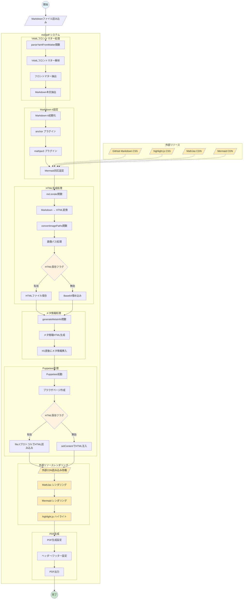

# md2pdf

[](./LICENSE)

Markdown → HTML → PDF 変換ツール

## 背景と目的

研究進捗やゼミ資料を Markdown で書きたい。

Markdownは数式・コード・箇条書きなどを簡潔に表現できるし、VSCodeなどのエディタで編集が容易。

しかし指導教員に見せる際は「紙 or PDF」である必要がある。

現状は VSCode で作成 → Typora で開いて印刷 → PDF化しており、Typoraを開くのが面倒。

そこで、Markdown ファイルを引数に渡すだけで GitHubのCSSが効いたPDFを出力するCLIツールを作成したい。

## 特徴

- **GitHub風のスタイリング**: GitHub Markdown CSS を使用した美しいレイアウト
- **数式対応**: MathJax による LaTeX 数式レンダリング
- **コードハイライト**: highlight.js によるシンタックスハイライト
- **図表対応**: Mermaid によるダイアグラム生成
- **画像埋め込み**: 相対パス画像の自動 Base64 変換
- **見出しナンバリング**: CSS カウンタによる自動番号付け
- **YAMLフロントマター**: 文書メタ情報の管理
- **詳細ログ**: 処理状況の可視化

## 依存関係

### 必要なライブラリ

```bash
npm install markdown-it markdown-it-anchor highlight.js markdown-it-mathjax3 puppeteer js-yaml
```

### パッケージ一覧

- `markdown-it`: Markdown パーサー
- `markdown-it-anchor`: 見出しアンカー生成
- `highlight.js`: コードハイライト
- `markdown-it-mathjax3`: MathJax 数式対応
- `puppeteer`: PDF 生成
- `js-yaml`: YAML フロントマター解析

## インストール

```sh
# リポジトリをクローン
git clone <repository-url>
cd md2pdf

# 依存関係をインストール
npm install

# 実行権限を付与
chmod +x md2pdf.mjs
```

## 使用方法

### 基本的な使い方

```sh
# 基本的な変換
./md2pdf.mjs input.md

# 出力ファイル名を指定
./md2pdf.mjs input.md output.pdf

# HTMLも保存する
./md2pdf.mjs input.md --save-html

# 詳細ログを表示
./md2pdf.mjs input.md --verbose

# 複数オプションの組み合わせ
./md2pdf.mjs input.md output.pdf --save-html --verbose
```

### エイリアス設定

`.zshrc` に以下を追加：

```sh
alias md2pdf="node $HOME/<your-tools-dir>/md2pdf/md2pdf.mjs"
```

## YAMLフロントマター

Markdown ファイルの先頭に YAML フロントマターを記述できます：

```yaml
---
date: 2025-10-11
author: <Your Name>
affiliation: <Your Affiliation>
---

# 研究タイトル

本文...
```

### 対応フィールド

- `date`: PDF ヘッダーに表示される日付
- `author`: 著者名（H1直下に表示）
- `affiliation`: 所属（H1直下に表示）

## 環境変数

以下の環境変数で動作をカスタマイズできます：

### HTML スタイル設定

```sh
export MD2HTML_FONT_SIZE="14px"           # フォントサイズ
export MD2HTML_LINE_HEIGHT="1.6"          # 行間
export MD2HTML_PADDING_X="32px"           # 左右パディング
export MD2HTML_PADDING_Y="24px"           # 上下パディング
export MD2HTML_CODE_FONT_SCALE="1em"      # コードフォントサイズ
export MD2HTML_PAGE_BG="#fff"             # ページ背景色
export MD2HTML_CODE_BG="#f6f8fa"          # コード背景色
export MD2HTML_MAX_WIDTH="auto"           # 最大幅
export MD2HTML_AUTO_NUMBER="1"            # 見出しナンバリング（0=無効）
```

### PDF 設定

```sh
export MD2PDF_FORMAT="A4"                 # 用紙サイズ
export MD2PDF_SCALE="1"                   # スケール
export MD2PDF_MARGIN_TOP="20mm"           # 上余白
export MD2PDF_MARGIN_RIGHT="12mm"         # 右余白
export MD2PDF_MARGIN_BOTTOM="16mm"        # 下余白
export MD2PDF_MARGIN_LEFT="12mm"          # 左余白
export MD2PDF_PRINT_BG="1"                # 背景印刷（0=無効）
export MD2PDF_SAVE_HTML="0"               # HTML保存（1=有効）
export MD2PDF_VERBOSE="0"                 # 詳細ログ（1=有効）
```

## フローチャート



## 印刷

```sh
lp your-file.pdf
```

> [!NOTE]
> **macOSでCanon MF741C/743Cを片面印刷にする方法**
>
> - 最初に `lp -o sides=one-sided` を試すが、**両面印刷のまま**になる。
> → macOSのCUPSではプリンタドライバ側の設定が優先される。
> - `lpoptions` で確認したところ、ドライバは **Canon MF741C/743C CARPS2**。 → このドライバは標準オプション `sides=` を無視する。
> - 一般的な `-o Duplex=None` も無効。Canon独自オプションを探す必要がある。
> - `lpoptions -l` で詳細一覧を出すと、
>   **`CNDuplex/Print Style: None *DuplexFront`** という項目を発見。
>   → これが片面／両面の切り替えキー。
> - 片面印刷する場合のコマンド：
>
>   ```bash
>   lp -d Canon_MF741C_743C__... -o CNDuplex=None your-file.pdf
>   ```
>
>   これで**片面印刷成功**。
> - 恒久設定も可能：
>
>   ```bash
>   lpoptions -p Canon_MF741C_743C__... -o CNDuplex=None
>   ```
>
>   以後は `lp <file>` だけで片面になる。
>
> **まとめ：**
> CanonのCARPS2ドライバでは `sides=` や `Duplex=` は無効。
> 片面印刷したい場合は **`-o CNDuplex=None`** が唯一正しく動作する。

## LICENSE

ISC License (ISC)

Copyright 2025 ppr

本ソフトウェアを使用、複製、改変、及び/または頒布する権利は、いかなる目的においても有償・無償を問わず、本許諾によって付与されます。ただし、上記の著作権表示及びこの許可表示が全ての複製物に記載されていることを条件とします。

本ソフトウェアは「現状のまま」提供されており、著者は、販売可能性及び適合性に関するあらゆる暗示的保証を含む、本ソフトウェアに関する全ての保証を放棄するものとします。いかなる場合も、契約に沿った行為の如何を問わず、過失またはその他の不法行為であるかにかかわらず、本ソフトウェアの使用または操作が原因で発生した使用不能損失、データまたは利益の損失に起因するあらゆる特別、直接的、間接的、または派生的な損害について著作者は一切の責任を負いません。
